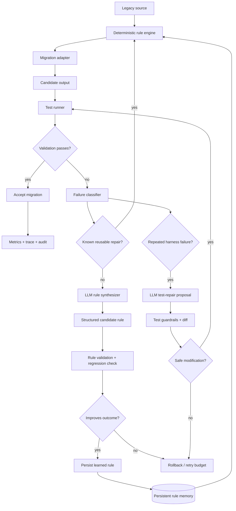
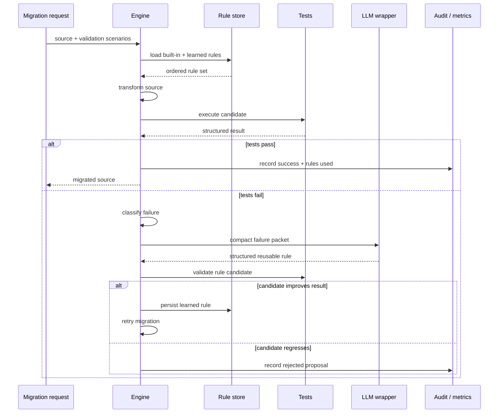
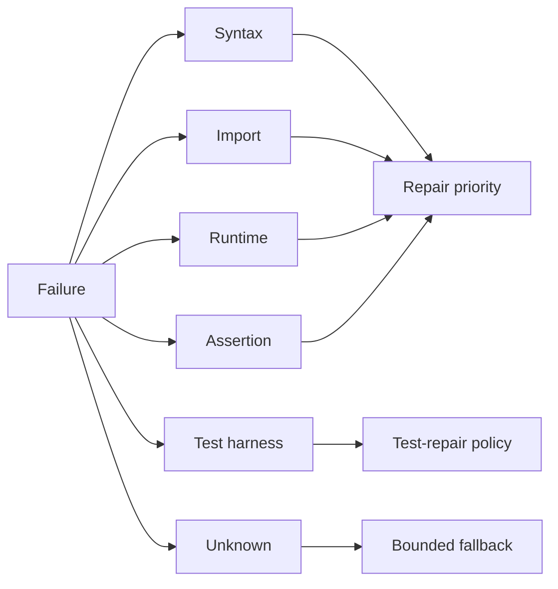

# Agentic Migrator

> **A test-driven, self-improving code migration system that turns successful LLM repairs into reusable deterministic rules.**

Agentic Migrator is a public reference architecture for modernizing code without handing an entire repository to an LLM and hoping for the best.

The system combines:

- deterministic migration rules;
- test-driven validation;
- structured failure classification;
- a bounded LLM repair loop;
- persistent rule memory;
- guarded test-harness repair;
- migration observability and benchmark metrics;
- auditable human-in-the-loop controls.

The public examples are intentionally synthetic so the repository demonstrates the architecture without exposing proprietary source code, migration rules or internal test suites.

---

## The core idea

A naive migration agent often looks like this:

```text
legacy code → giant LLM prompt → rewritten code → hope
```

Agentic Migrator instead treats the LLM as an **exception handler and rule synthesizer**.



A successful fix becomes **memory**. The next migration can apply it before another LLM call is needed.

---

## Why not pure LLM rewriting?

Whole-program rewriting is difficult to reproduce, expensive to validate and hard to debug.

This design gives the migration process:

- deterministic first-pass behavior;
- lower dependence on LLM calls;
- reusable learned transformations;
- explicit failure traces;
- bounded retries;
- regression validation;
- auditable rule provenance;
- a strict boundary between source repair and test repair.

The system is deliberately opinionated: **the agent is allowed to learn, but not to quietly redefine success.**

---

## Migration lifecycle



---

## Hard rules

Hand-written rules cover known migration patterns such as:

- renamed APIs;
- deprecated keyword arguments;
- import-path changes;
- syntax rewrites;
- configuration-key migrations;
- wrapper replacement patterns.

Hard rules are cheap, deterministic and easy to regression-test.

---

## Learned rules

When deterministic rules are insufficient, the LLM wrapper receives a compact failure packet containing:

- source fragment;
- generated fragment;
- failing scenario;
- failure classification;
- stderr / assertion context;
- currently active rule IDs.

The wrapper returns a **structured rule proposal** instead of unrestricted free-form code.

Example rule memory:

```json
{
  "id": "learned.rename_timeout_kwarg.v1",
  "pattern": "timeout_seconds=",
  "replacement": "timeout=",
  "reason": "target API renamed keyword argument",
  "created_by": "llm",
  "success_count": 4,
  "failure_count": 0
}
```

A proposed rule is persisted only if it improves the failing scenario and survives the configured regression validation.

---

## Guarded test repair

Sometimes the migrated program is valid but the test harness is stale: an import path changed, fixture layout moved or environment setup no longer matches the target runtime.

The agent may propose a test repair only after a configurable repeated-failure threshold.

Test modifications are held to a stricter policy than source transformations:

- original tests remain versioned;
- assertion deletion is rejected by default;
- broad exception swallowing is rejected;
- expected values cannot silently be weakened;
- accepted modifications retain a unified diff;
- the migration trace records why the harness changed.

This prevents the classic autonomous-agent failure mode of **"fixing" the migration by making the tests easier**.

---

## Migration observability

The repository includes `migrator/metrics.py`, which projects detailed migration traces into portfolio- and CI-friendly metrics.

Tracked metrics include:

| Metric | Why it matters |
|---|---|
| Pass rate | Overall migration convergence |
| First-pass success | Effectiveness of deterministic memory |
| LLM avoidance rate | How often the system succeeds without repair calls |
| Learned-rule reuse | Whether successful repairs actually become reusable knowledge |
| Average attempts | Convergence efficiency |
| Rule usage | Which migration knowledge provides value |
| Failure-kind distribution | Where migration effort is being spent |
| Test-repair rate | How often stale harnesses are involved |
| Regression failures | Whether candidate rules damage existing scenarios |

The synthetic benchmark can be run with:

```bash
python examples/benchmark_report.py
```

It writes machine-readable JSON and a Markdown summary under `artifacts/`.

> Benchmark records shipped with the public example are synthetic demonstrations of the metric pipeline, not claimed production performance.

---

## Failure model

The engine distinguishes failure classes rather than treating every exception as the same prompt:



A later, more local failure can represent progress. For example, moving from an import error to a specific assertion failure often means the migration has advanced far enough to execute the target behavior.

---

## Repository layout

```text
agentic-migrator/
├── migrator/
│   ├── engine.py          # bounded migration loop
│   ├── models.py          # structured domain objects
│   ├── rules.py           # rule store + deterministic transforms
│   ├── failures.py        # failure classification
│   ├── llm.py             # structured synthesizer interface
│   ├── metrics.py         # migration observability
│   └── test_guard.py      # guarded harness repair
├── rules/
│   └── builtin.json
├── examples/
│   ├── python_api_migration.py
│   └── benchmark_report.py
├── tests/
│   └── test_engine.py
├── .github/workflows/
│   └── ci.yml
├── requirements-dev.txt
└── README.md
```

---

## Engineering decisions

### LLM calls are deliberately late

The system tries reusable deterministic knowledge first. This reduces cost, nondeterminism and prompt sensitivity.

### The rule store is an explicit memory boundary

Agent memory is not hidden in conversation history. Successful transformations are versionable artifacts with IDs and provenance.

### Repair loops are bounded

`max_attempts` prevents non-converging autonomous loops from consuming unlimited time or tokens.

### Test repair is a separate authority domain

Changing implementation and changing validation are not equivalent operations. The guard layer makes that distinction explicit.

### Observability is part of the architecture

If a migration system learns new rules, it should also make it possible to answer:

- Which rules are being reused?
- Which migrations still need the LLM?
- Where does the process fail?
- Did a learned rule improve future conversions?
- Are test repairs becoming suspiciously common?

---

## Example interview walkthrough

A concise way to explain the project:

> I built a migration loop where deterministic rules handle known transformations first. The converted candidate is validated against scenarios. If it fails, the failure is classified and an LLM is asked for a minimal reusable rule rather than a full rewrite. Candidate rules are regression-tested before they enter a persistent rule store, so successful fixes become deterministic behavior on future migrations. Repeated harness failures can trigger a separate guarded test-repair path, and the entire process is bounded and observable.

That description maps directly to concrete code in this repository.

---

## What this demonstrates

- agentic AI;
- code transformation;
- test-driven migration;
- self-improving rule systems;
- LLM tool use;
- structured outputs;
- persistent agent memory;
- bounded autonomous loops;
- regression testing;
- audit logging;
- human-in-the-loop controls;
- migration observability;
- failure classification;
- safe automation design.

---

## Status

The project is an actively developed public reference implementation. Current examples focus on small Python API migrations and synthetic validation scenarios; the architecture is intentionally structured so additional language adapters, AST transforms, containerized test runners and repository-scale orchestration can be added without changing the core control loop.
