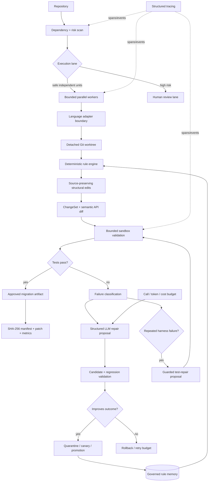
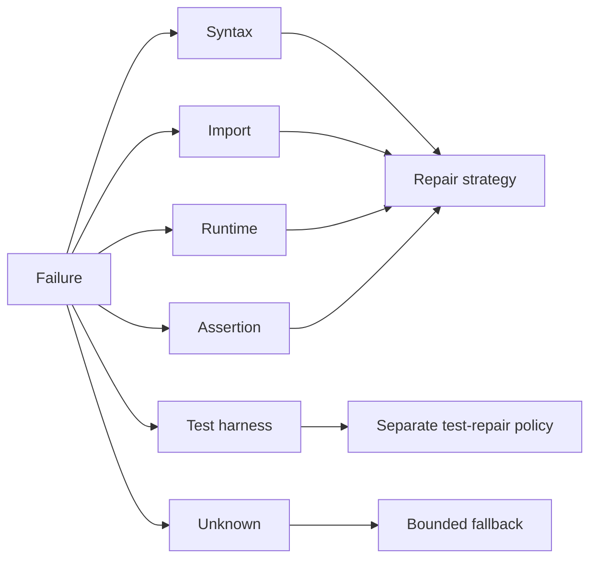

# Agentic Migrator

> **A test-driven, self-improving code-migration system that turns successful LLM repairs into reusable deterministic rules.**

Agentic Migrator is a public reference architecture for modernizing code without handing an entire repository to an LLM and hoping for the best. It treats the LLM as a **bounded exception handler and rule synthesizer**, while deterministic transformations, isolated validation, rollback boundaries, observability and governance remain explicit software components.

All examples are synthetic. No proprietary source code, migration rules or internal test suites are included.

## Architecture



The core principle is simple:

```text
legacy repository
  → inspect dependency/risk structure
  → isolate work
  → deterministic migration first
  → validate
  → ask the LLM only for unresolved failures
  → promote reusable repairs only after evidence
```

## What is implemented

### 1. Dependency-aware repository planning

`migrator/project_scan.py` parses Python files, builds local dependency relationships, identifies dependency cycles and produces an ordered migration plan with explicit risk reasons. The CLI exposes it directly:

```bash
agentic-migrator scan . --format markdown --output artifacts/migration-plan.md
```

This makes repository-scale migration an ordering/problem-decomposition task rather than a directory-wide rewrite.

### 2. Source-preserving structural migration

`migrator/ast_rules.py` uses the Python AST to identify semantic nodes, but deliberately **does not serialize the whole program with `ast.unparse()`**.

Instead it applies byte-range edits back onto the original UTF-8 source. That means deterministic migrations can change imports, bound module names, keyword arguments and attribute chains while preserving unrelated:

- comments;
- string literals;
- whitespace and formatting;
- source text outside the targeted syntax node.

For example, an API migration can change:

```python
# legacy_client is intentionally mentioned in this comment
import legacy_client
result = legacy_client.request(timeout_seconds=5)
```

into code using `modern_client.request(timeout=5)` without rewriting the comment merely because it contains the old identifier.

The structural transformer is covered by regression tests that explicitly require comments and strings to survive.

### 3. Deterministic rules + governed learned rules

Known transformations are cheap deterministic rules. When those rules do not resolve a failure, the LLM interface receives a compact failure packet and proposes a **structured reusable rule**, not an unrestricted whole-program rewrite.

Successful proposals do not immediately become globally trusted. `migrator/governance.py` models a rule lifecycle:

```text
quarantined → canary → promoted
               ↓
            disabled
```

Promotion uses validation success, cross-migration reuse, success rate and regression evidence. A previously promoted rule can be quarantined again if regression evidence appears.

### 4. Bounded sandbox validation

`migrator/sandbox.py` provides a bounded local subprocess boundary for migration validation:

- no shell invocation;
- executable allowlist;
- stripped environment with explicit allowlisted overrides;
- absolute/parent-path rejection for materialized files;
- temporary working directory;
- execution timeout;
- captured-output byte limit.

`migrator/runners.py` adapts this boundary to the migration engine through `PytestSandboxRunner`. Candidate code and its active test harness are materialized into a temporary workspace and evaluated with pytest without mutating the developer checkout.

```bash
agentic-migrator sandbox-test candidate.py test_candidate.py --timeout 20
```

> `LocalSandbox` is a process-isolation reference boundary, **not a hardened hostile-code sandbox**. Untrusted code should additionally run inside a locked-down container, VM, seccomp profile or remote worker pool.

### 5. Git isolation and patch boundaries

`migrator/repository.py` provides a thin Git boundary with:

- clean-checkout enforcement;
- HEAD/branch checkpoints;
- detached temporary worktrees;
- binary diff / patch export;
- patch validation/application;
- destructive reset only through an explicit opt-in flag.

A failed migration can therefore die inside a disposable worktree rather than leaving a developer checkout half-mutated.

```bash
agentic-migrator git-checkpoint . --require-clean
agentic-migrator git-patch . --output artifacts/migration.patch
```

### 6. Auditable change plans and rollback

The repository intentionally separates two responsibilities:

- `migrator.gitops.ChangeSet` — an **in-memory preflight plan** for create/update/delete operations, unified diffs, SHA-256 before/after hashes and per-file rollback;
- `migrator.workspace.MigrationWorkspace` — a **filesystem transaction layer** that snapshots files, applies an approved text plan, verifies post-change hashes and restores the original snapshot.

Both boundaries reject attempts to escape the migration root. This keeps “what the agent proposes” separate from “what is actually written to disk.”

### 7. Semantic API diff

Passing tests is necessary but not always sufficient for a library migration. `migrator/semantic_diff.py` compares public function/class signatures before and after a transformation and reports:

- added public symbols;
- removed public symbols;
- changed signatures;
- whether the API delta is potentially breaking.

```bash
agentic-migrator semantic-diff before.py after.py --fail-on-breaking
```

This gives CI a lightweight compatibility gate in addition to behavior tests.

### 8. LLM usage and enforceable budgets

`migrator/cost.py` keeps an append-only JSONL usage ledger for optional LLM-assisted repair calls. A `BudgetPolicy` can reject a projected call **before it is recorded/executed** when it would exceed configured limits for:

- number of calls;
- input tokens;
- output tokens;
- estimated USD cost.

This complements the engine's `max_attempts`: autonomy is bounded both by convergence attempts and by explicit LLM resource budgets.

```bash
agentic-migrator cost-summary --ledger artifacts/llm_usage.jsonl
```

### 9. Guarded test repair

Test repair is treated as a separate authority domain from source repair. The guard layer rejects obvious success-redefinition patterns such as:

- reducing the assertion count;
- introducing unconditional `assert True`;
- broad exception swallowing;
- adding pytest skip directives.

Accepted test changes retain a unified diff and are recorded in the migration trace.

### 10. Migration metrics

`migrator/metrics.py` projects execution traces into CI/portfolio metrics including:

| Metric | Why it matters |
|---|---|
| Pass rate | Overall migration convergence |
| First-pass success | Effectiveness of deterministic knowledge |
| LLM avoidance rate | How often repair calls are unnecessary |
| Learned-rule reuse | Whether repair knowledge becomes reusable |
| Average attempts | Convergence efficiency |
| Rule usage | Which migration knowledge provides value |
| Failure-kind distribution | Where migration effort is spent |
| Test-repair rate | How often validation infrastructure changes |
| Regression failures | Whether candidate rules damage known scenarios |

The synthetic benchmark writes machine-readable JSON and a Markdown summary:

```bash
python examples/benchmark_report.py
```

Benchmark records in this public repository demonstrate the metric pipeline; they are not claimed production results.

### 11. Structured tracing + optional OpenTelemetry bridge

`migrator/tracing.py` adds nested spans, parent/child IDs, duration, attributes, events and error metadata. The dependency-free recorder can append JSONL traces as CI artifacts.

```python
from migrator.tracing import TraceRecorder

recorder = TraceRecorder(output="artifacts/migration-trace.jsonl")
with recorder.span("repository.migrate", files=12):
    recorder.event("scan.complete", cycles=1)
    with recorder.span("file.migrate", path="service.py"):
        ...
```

`OpenTelemetryBridge` is an optional integration point: when OpenTelemetry is installed/configured it can mirror spans to the active tracer provider; otherwise the core project remains dependency-light. The repository deliberately does not relabel its local JSONL format as OpenTelemetry.

### 12. Risk-aware parallel repository execution

`migrator/parallel.py` provides bounded concurrent execution for independent migration units.

- worker count is explicit;
- units above an automatic risk ceiling are diverted to a review lane;
- worker failures become structured results;
- execution can finish in any order while returned results remain deterministically sorted;
- summaries expose success/failure/review counts.

```python
from migrator.parallel import MigrationTask, ParallelMigrationExecutor

executor = ParallelMigrationExecutor(migrate_one_file, max_workers=4)
results, review_lane = executor.run([
    MigrationTask("api.py", api_payload, risk_score=0.20),
    MigrationTask("legacy_core.py", core_payload, risk_score=0.94),
])
```

The high-risk unit is deferred rather than silently pushed through the same autonomous lane.

### 13. Language adapter boundary

`migrator/adapters.py` separates repository orchestration from language-specific source handling.

The public registry currently includes:

- Python validation through `ast.parse`;
- lightweight Java structural validation;
- lightweight JavaScript/TypeScript delimiter validation;
- source normalization and language detection.

These lightweight Java/JavaScript validators are **not claimed to be compilers**. Python remains the deepest public structural-transform implementation; additional real parser/compiler-backed language adapters can be mounted behind the same interface.

For the complete design and runnable trace/parallel example, see `docs/observability_and_parallelism.md`.

```bash
python examples/parallel_trace_demo.py
```

## Failure model

The engine distinguishes failure categories rather than turning every exception into the same prompt:



A later, more local failure can count as progress: moving from a syntax/import failure to a specific assertion failure means the migrated code has advanced far enough to execute target behavior.

## Quick start

```bash
python -m venv .venv
source .venv/bin/activate  # Windows: .venv\Scripts\activate
pip install -e ".[dev]"

agentic-migrator --help
agentic-migrator scan . --format markdown
pytest -q
python examples/parallel_trace_demo.py
```

Useful CLI commands:

```text
scan             dependency-aware migration planning
transform        apply structural source-preserving migration rules
semantic-diff    compare public API signatures
sandbox-test     validate a candidate in the bounded temporary runner
git-checkpoint   inspect the source repository checkpoint
git-patch        export a reviewable migration patch
cost-summary     summarize LLM usage and estimated cost
```

## Repository layout

```text
agentic-migrator/
├── migrator/
│   ├── engine.py          # bounded migration / repair loop
│   ├── ast_rules.py       # AST-guided source-preserving transforms
│   ├── project_scan.py    # dependency + migration-risk planning
│   ├── adapters.py        # language-specific normalization / validation boundary
│   ├── parallel.py        # risk-aware bounded concurrent execution
│   ├── tracing.py         # JSONL tracing + optional OpenTelemetry bridge
│   ├── rules.py           # deterministic and learned rule storage
│   ├── governance.py      # quarantine / canary / promotion policy
│   ├── sandbox.py         # bounded subprocess validation boundary
│   ├── runners.py         # sandbox → MigrationEngine adapters
│   ├── semantic_diff.py   # public API compatibility comparison
│   ├── gitops.py          # in-memory ChangeSet + diffs / hashes
│   ├── workspace.py       # filesystem snapshot / apply / verify / rollback
│   ├── repository.py      # Git checkpoint / worktree / patch boundary
│   ├── cost.py            # token/cost ledger + budget gates
│   ├── metrics.py         # migration observability
│   ├── test_guard.py      # guarded harness repair
│   ├── llm.py             # structured synthesizer interface
│   ├── models.py          # domain objects and failure types
│   └── cli.py             # command-line interface
├── docs/
│   └── observability_and_parallelism.md
├── rules/
│   └── builtin.json
├── examples/
│   ├── benchmark_report.py
│   ├── parallel_trace_demo.py
│   └── repository_migration_plan.py
├── tests/                 # engine, governance, sandbox, adapters, tracing, Git tests
├── .github/workflows/
│   └── ci.yml
├── Dockerfile
├── pyproject.toml
└── README.md
```

## Engineering decisions

**LLM calls are deliberately late.** Reusable deterministic knowledge is tried first, reducing cost, nondeterminism and prompt sensitivity.

**Source editing and source parsing are separate concerns.** The AST identifies what should change; byte-range edits preserve everything else.

**Agent memory is explicit.** Successful repairs become versionable rule artifacts with IDs and provenance rather than disappearing into chat history.

**Rule learning does not imply rule trust.** New rules accumulate evidence through quarantine/canary states before broad reuse.

**Changing implementation and changing validation are different authorities.** Test repair has separate guardrails and audit evidence.

**Repository mutation is transactional.** Proposed changes, filesystem application and Git integration are separate layers with hashes, manifests, worktrees and rollback paths.

**Concurrency does not erase governance.** Parallel execution only applies to the automatic lane; higher-risk units remain reviewable and result reporting is deterministic.

**Observability is not prompt logging.** Migration spans/events and LLM cost records are structured artifacts that can be inspected independently of model conversation text.

**Autonomy has multiple budgets.** Attempts, allowed processes, runtime, output volume, concurrency, risk thresholds, LLM calls, tokens and estimated cost all have explicit boundaries.

## Interview walkthrough

A concise explanation of the project:

> I built a deterministic-first code-migration system. It scans repository dependencies to plan migration order, partitions work by risk, and can validate independent units concurrently while keeping results deterministic. Python migrations use AST-guided edits that preserve untouched source text. Candidates are evaluated in bounded temporary runners and isolated Git worktrees. Known transformations stay deterministic; unresolved failures can ask an LLM for a small reusable rule, but calls are budgeted and learned rules pass regression and governance gates before wider reuse. Changes are represented as hashed change sets with rollback, public API signatures can be compared semantically, and migration runs emit metrics plus structured traces with an optional OpenTelemetry bridge.

## What this demonstrates

- agentic AI with bounded autonomy;
- deterministic-first code migration;
- AST-guided, source-preserving transformations;
- dependency-aware repository planning;
- risk-aware parallel execution;
- language-adapter architecture;
- structured tracing and optional OpenTelemetry integration;
- sandboxed test execution boundaries;
- Git worktree isolation and patch workflows;
- semantic API compatibility checks;
- create/update/delete manifests and rollback;
- persistent rule memory and governance;
- LLM call/token/cost budgeting;
- guarded test repair;
- regression testing and CI/CD;
- observability and audit trails;
- human-reviewable automation.

## CI

GitHub Actions installs the package, runs Ruff and pytest, executes the synthetic migration benchmark, runs the traceable parallel demo, smoke-tests the CLI and sandbox path, builds the Docker image and checks the container entrypoint.

The project is an actively developed reference implementation. Python currently has the deepest structural migration adapter; other language boundaries are intentionally explicit so stronger compiler/parser-backed adapters can be added without moving language semantics into the LLM prompt.
