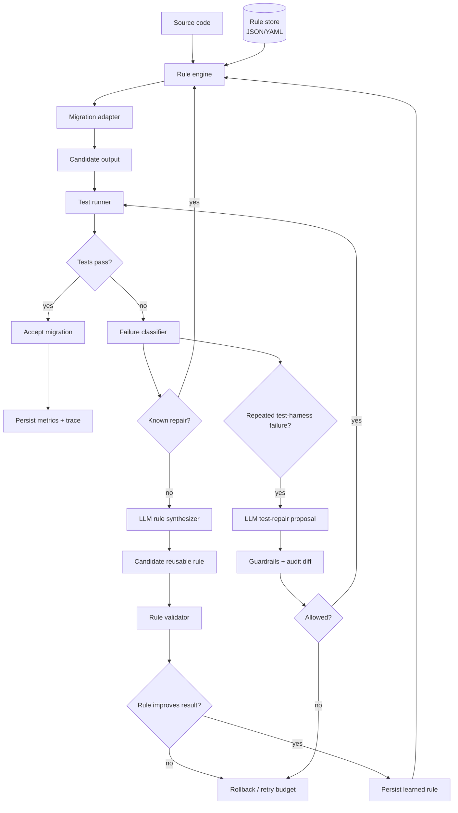

# Agentic Migrator

A self-improving code migration pipeline that combines **deterministic transformation rules**, **test-driven validation**, and an **LLM rule synthesizer**.

Instead of asking an LLM to rewrite an entire codebase in one shot, Agentic Migrator uses a bounded repair loop:

1. apply known migration rules;
2. convert the source;
3. run validation scenarios;
4. classify failures;
5. ask an LLM wrapper for a *minimal reusable rule* only when deterministic rules are insufficient;
6. persist successful rules into the rule store;
7. retry the conversion;
8. optionally propose a test-harness repair when the same infrastructure-style failure repeats.

The important idea is that successful fixes become **memory**. Future conversions can apply the learned rule automatically before invoking the LLM again.

## Architecture



## Why not pure LLM rewriting?

Whole-program rewriting is difficult to reproduce and hard to debug. This design treats the LLM as an **exception handler / rule synthesizer**, not the default execution path.

That gives the system:

- deterministic first-pass behavior;
- lower LLM usage;
- reusable learned rules;
- explicit failure traces;
- regression tests;
- auditable rule history;
- bounded retries;
- a separation between code repair and test-harness repair.

## Core concepts

### Hard rules

Hand-written rules cover known migration patterns such as renamed APIs, import changes, deprecated argument names or syntax rewrites.

### Learned rules

If conversion fails and no known rule applies, the LLM wrapper receives a compact failure packet containing the source fragment, generated fragment, failing test information and active rule IDs. It returns a structured rule proposal rather than arbitrary free-form code.

A rule is persisted only after it improves the failing scenario and passes regression validation.

### Rule memory

Learned rules are stored with provenance:

```json
{
  "id": "learned.rename_timeout_kwarg.v1",
  "pattern": "timeout_seconds=",
  "replacement": "timeout=",
  "reason": "target API renamed keyword argument",
  "created_by": "llm",
  "success_count": 4,
  "failure_count": 0
}
```

### Guarded test repair

Sometimes the migrated program is valid but the test harness itself is stale: an import path changed, fixture format changed, or the same environment/setup error repeats.

The agent may propose a test repair only after a configurable repeated-failure threshold. Test changes are treated differently from migration rules:

- original tests remain versioned;
- assertion deletion is rejected by default;
- broad exception swallowing is rejected;
- expected values cannot silently be weakened;
- every accepted test modification is recorded with a diff and reason.

This avoids the classic agent failure mode of "fixing" a migration by making the tests easier.

## Repository layout

```text
agentic-migrator/
├── migrator/
│   ├── engine.py
│   ├── models.py
│   ├── rules.py
│   ├── failures.py
│   ├── llm.py
│   └── test_guard.py
├── rules/
│   └── builtin.json
├── examples/
│   └── python_api_migration.py
├── tests/
│   └── test_engine.py
└── README.md
```

## Portfolio keywords, earned rather than sprinkled

- agentic AI
- code transformation
- test-driven migration
- self-improving rule systems
- LLM tool use
- structured outputs
- failure classification
- persistent agent memory
- bounded autonomous loops
- regression testing
- audit logging
- human-in-the-loop controls

## Status

The public version uses toy migration examples and synthetic test scenarios. It is designed to demonstrate the architecture without exposing proprietary source code, migration rules or internal test suites.
