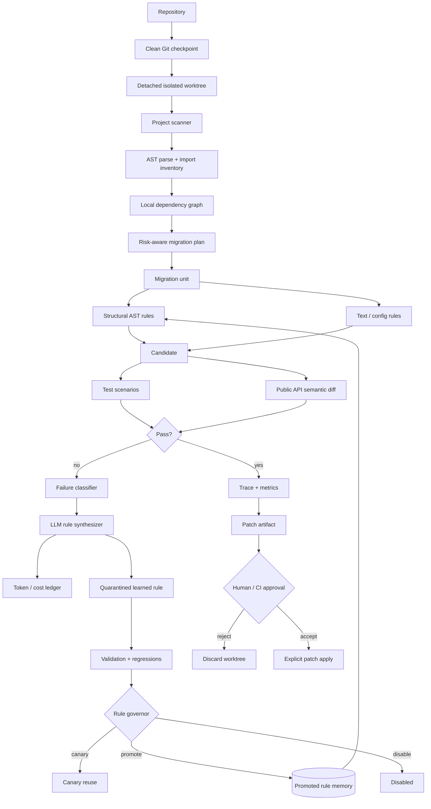
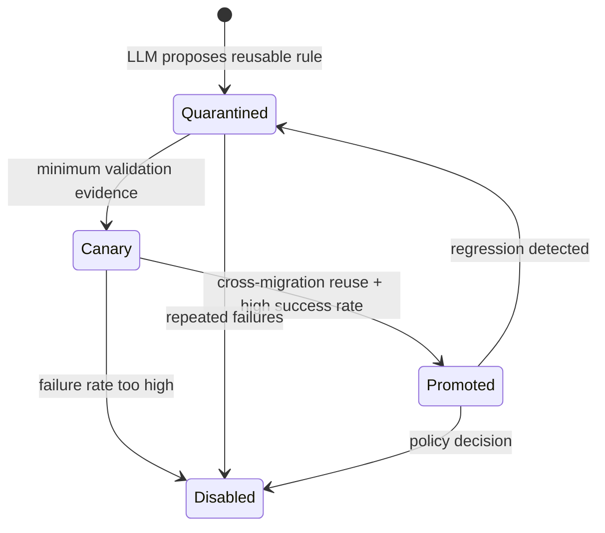
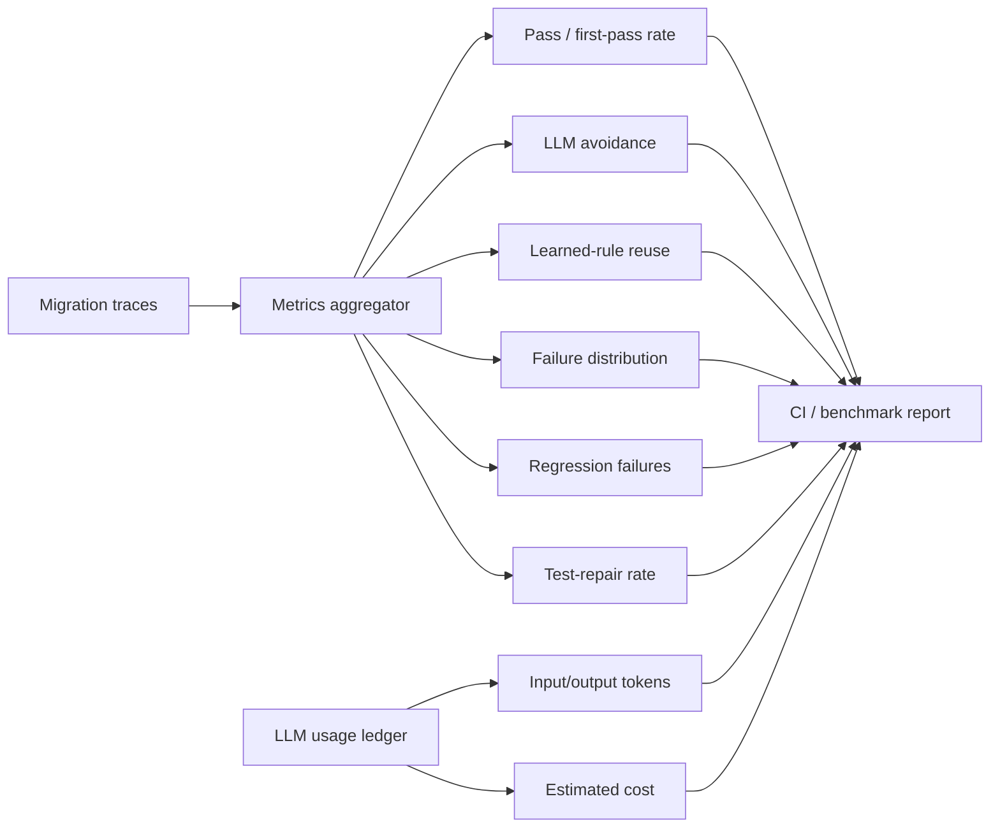

# Agentic Migrator — Visual Showcase

This page is a compact visual companion to the main README.

## 1. Repository-scale control plane



## 2. Learned-rule lifecycle



The important design choice is that **LLM output is not immediately trusted as global memory**. A successful repair can enter quarantine, accumulate evidence, move through canary reuse and only then become broadly reusable.

## 3. Migration observability



## 4. Why AST rules matter

A text rule can accidentally rewrite strings, comments or unrelated identifiers. `migrator/ast_rules.py` adds a structural layer for transformations such as:

- import-module migration;
- function keyword migration;
- qualified attribute migration.

This gives the engine two deterministic tools:

```text
cheap exact text rules
        +
syntax-aware AST transforms
        ↓
LLM exception handling only when necessary
```

## 5. Repository planning

`migrator/project_scan.py`:

1. discovers Python source files;
2. parses imports;
3. maps local dependencies;
4. detects dependency cycles using Tarjan strongly-connected components;
5. generates a dependency-aware migration order;
6. assigns risk based on parse failures, file size, coupling, cycles and configured high-risk APIs.

Run:

```bash
PYTHONPATH=. python examples/repository_migration_plan.py . \
  --high-risk-import legacy_sdk \
  --output artifacts/migration_plan.md
```

## 6. Git isolation and patch approval

`migrator/repository.py` now provides a real Git safety boundary:

- refuses to start an isolated migration from a dirty checkout;
- records the current commit/branch checkpoint;
- creates a **detached temporary worktree** for migration attempts;
- deletes the temporary worktree after the attempt;
- exports binary-safe patch artifacts;
- can validate/apply patches explicitly;
- keeps destructive hard reset behind an explicit `allow_destructive=True` flag.

The source checkout therefore does not need to be the experimental workspace.

Useful commands:

```bash
agentic-migrator git-checkpoint . --require-clean
agentic-migrator git-patch . --base HEAD --output artifacts/migration.patch
```

## 7. Semantic migration guard

Passing tests does not prove that a public API stayed compatible. `migrator/semantic_diff.py` adds an AST-based public API surface check for Python modules.

It detects:

- added public functions/classes;
- removed public functions/classes;
- changed function argument signatures;
- changed public method surfaces on classes.

```bash
agentic-migrator semantic-diff before.py after.py --fail-on-breaking
```

This is intentionally a **guardrail**, not a claim that static API comparison proves behavioral equivalence. It complements tests and scenario validation.

## 8. LLM cost / token accounting

`migrator/cost.py` provides a provider-agnostic append-only JSONL ledger for optional LLM repair calls. A pricing record defines input/output price per million tokens; every rule-synthesis or test-repair call can record:

- model;
- operation;
- input/output token counts;
- calculated USD cost;
- migration metadata;
- timestamp.

```bash
agentic-migrator cost-summary --ledger artifacts/llm_usage.jsonl
```

This makes **LLM avoidance** measurable not only as a percentage but eventually as latency/cost avoided by deterministic and learned-rule reuse.

## 9. Portfolio dashboard

A static UI prototype is included at [`migration_dashboard.html`](migration_dashboard.html). It visualizes the kinds of signals the control plane exposes: convergence, deterministic reuse, LLM avoidance, rule promotion and failing migration units.

## 10. What I would build next

Already implemented from the old roadmap: containerized bounded test runner, Git worktree isolation, semantic public-API diff and token/cost accounting.

Next high-value extensions:

- Java and TypeScript language adapters;
- OpenTelemetry traces across migration attempts;
- patch-level web approval workflow;
- rule-store persistence in PostgreSQL/object storage;
- distributed worker queue for repository-scale batches;
- canary migration campaigns and automatic rollback;
- dependency/version compatibility resolver;
- semantic equivalence probes using generated differential tests.
