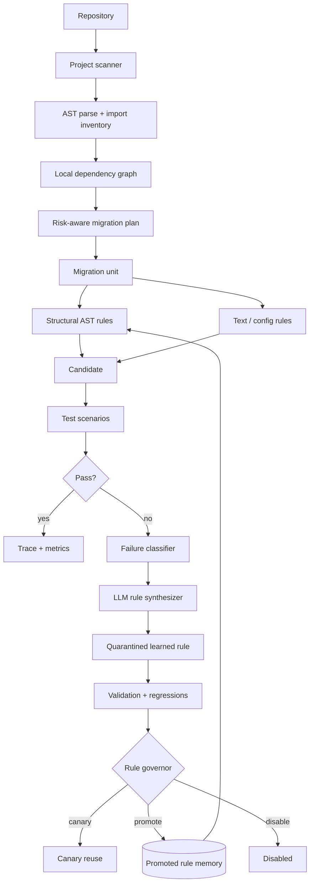
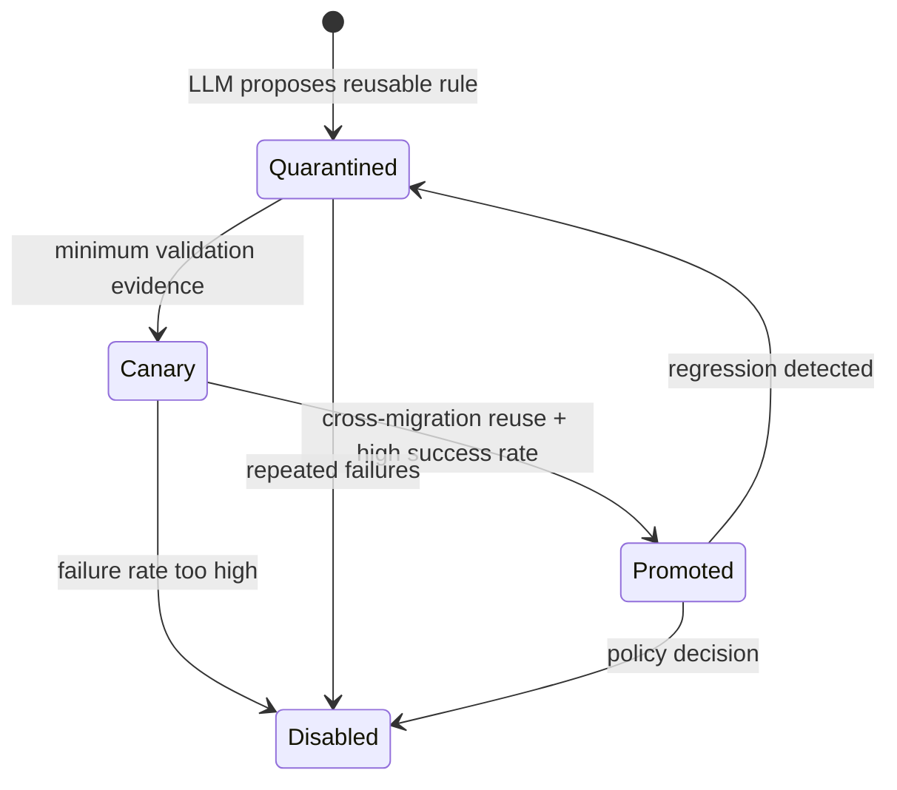
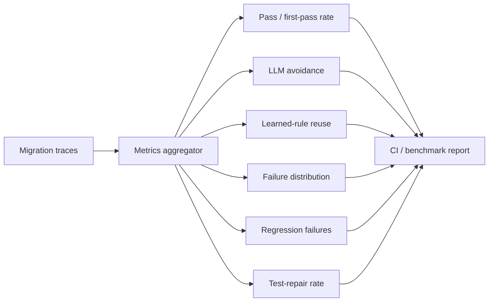

# Agentic Migrator — Visual Showcase

This page is a compact visual companion to the main README.

## 1. Repository-scale control plane



## 2. Learned-rule lifecycle



The important design choice is that **LLM output is not immediately trusted as global memory**. A successful repair can enter quarantine, accumulate evidence, move through canary reuse and only then become broadly reusable.

## 3. Migration observability



## 4. Why AST rules matter

A text rule can accidentally rewrite strings, comments or unrelated identifiers. `migrator/ast_rules.py` adds a structural layer for transformations such as:

- import-module migration;
- function keyword migration;
- qualified attribute migration.

This gives the engine two deterministic tools:

```text
cheap exact text rules
        +
syntax-aware AST transforms
        ↓
LLM exception handling only when necessary
```

## 5. Repository planning

`migrator/project_scan.py`:

1. discovers Python source files;
2. parses imports;
3. maps local dependencies;
4. detects dependency cycles using Tarjan strongly-connected components;
5. generates a dependency-aware migration order;
6. assigns risk based on parse failures, file size, coupling, cycles and configured high-risk APIs.

Run:

```bash
PYTHONPATH=. python examples/repository_migration_plan.py . \
  --high-risk-import legacy_sdk \
  --output artifacts/migration_plan.md
```

## 6. Portfolio dashboard

A static UI prototype is included at [`migration_dashboard.html`](migration_dashboard.html). It visualizes the kinds of signals the control plane would expose: convergence, deterministic reuse, LLM avoidance, rule promotion and failing migration units.

## 7. What I would build next

- containerized test runners with CPU/memory/time budgets;
- git worktree isolation per migration attempt;
- language adapters beyond Python;
- semantic-diff scoring;
- patch-level human approval;
- OpenTelemetry traces;
- rule-store persistence in PostgreSQL/object storage;
- distributed worker queue for repository-scale batches;
- canary migration campaigns and automatic rollback;
- cost/token accounting per migration family.
