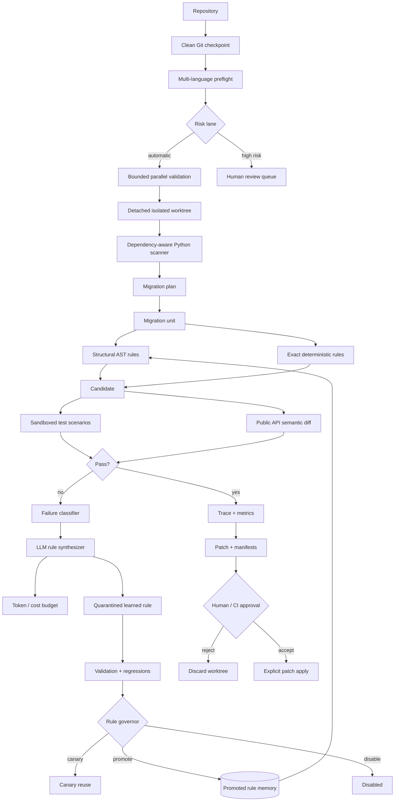
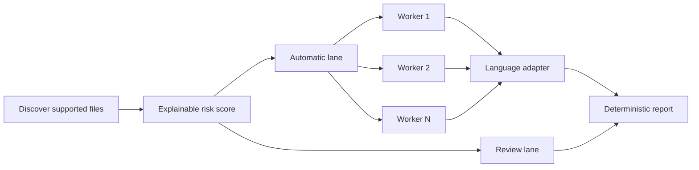
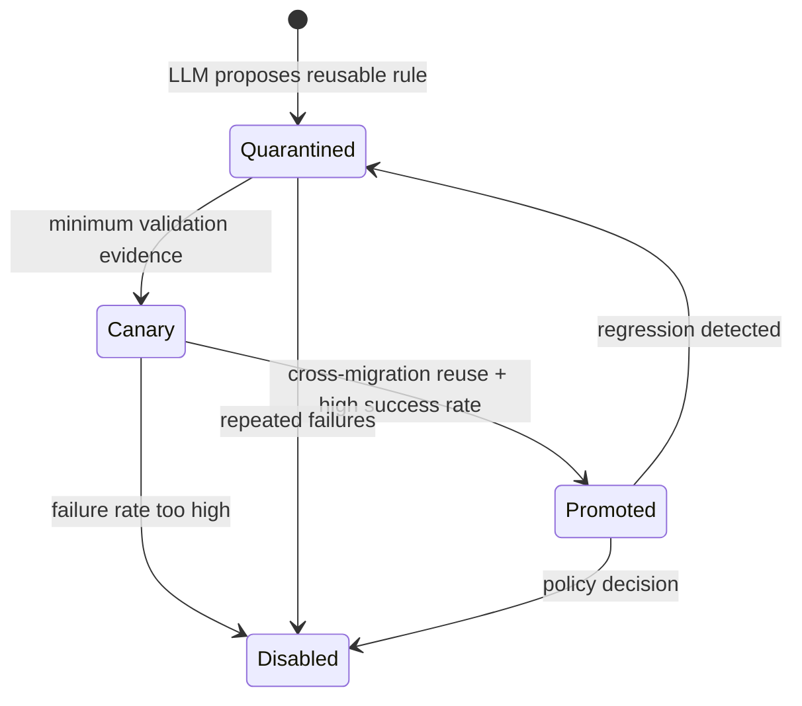
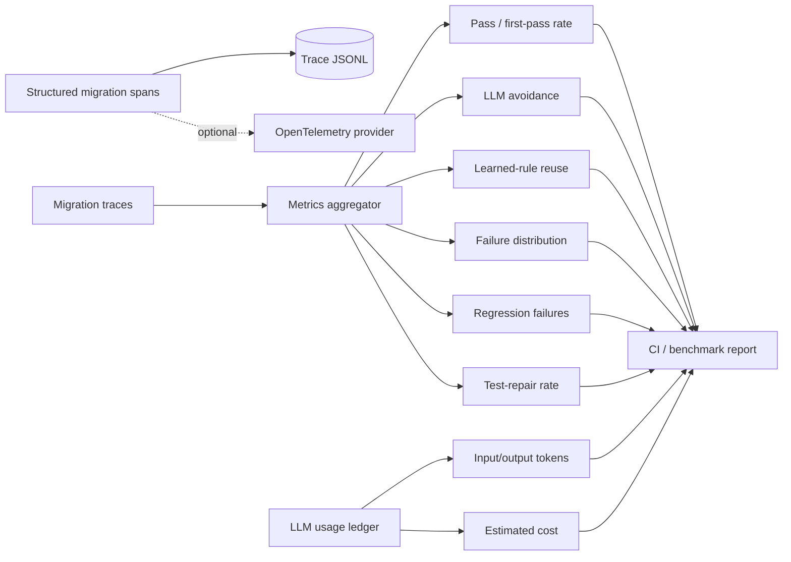

# Agentic Migrator — Visual Showcase

A compact visual companion to the main README. The project is intentionally designed as a **migration control plane**, not a chat prompt that rewrites a repository in one pass.

## 1. Repository-scale control plane



## 2. Repository preflight

The `preflight` CLI command ties together the adapter registry, risk partitioning, parallel executor and structured tracer.

```bash
agentic-migrator preflight . \
  --workers 4 \
  --high-risk-pattern 'core/*' \
  --trace-output artifacts/preflight-trace.jsonl \
  --output artifacts/preflight-report.json \
  --fail-on-invalid
```

The public risk heuristic is intentionally transparent rather than pretending to be an ML safety score:

```text
base risk
 + bounded file-size component
 + explicit user-supplied high-risk glob bump
 = execution-lane score
```

Supported files are discovered through `AdapterRegistry`. High-risk units are held out of the automatic parallel lane; lower-risk units are validated concurrently and returned in deterministic path order.



## 3. Language adapter boundary

`migrator/adapters.py` separates repository orchestration from language-specific preflight behavior.

Current public adapters:

| Language family | Current preflight validation | Depth |
|---|---|---|
| Python | `ast.parse` | deepest; also has structural source-preserving migrations |
| Java | lightweight structural validation | architecture boundary, not a compiler |
| JavaScript / TypeScript | delimiter/string structural validation | architecture boundary, not a compiler |

This distinction is deliberate. The repository does **not** pretend a brace validator is equivalent to `javac`, TypeScript Compiler API or tree-sitter. Stronger compiler/parser-backed adapters can replace the lightweight validators behind the same interface.

## 4. Learned-rule lifecycle



The important design choice is that **LLM output is not immediately trusted as global memory**. A successful repair can enter quarantine, accumulate evidence, move through canary reuse and only then become broadly reusable.

## 5. Migration observability



`TraceRecorder` is dependency-free and records nested span IDs, parent IDs, durations, attributes, events and error metadata. `OpenTelemetryBridge` is a separate optional integration point; the local JSONL format is not mislabeled as OpenTelemetry.

## 6. Why AST rules matter

A text rule can accidentally rewrite strings, comments or unrelated identifiers. `migrator/ast_rules.py` adds a structural layer for transformations such as:

- import-module migration;
- function keyword migration;
- qualified attribute migration.

The parser determines **what syntax node should change**, while byte-range edits preserve unrelated source text.

```text
cheap exact rules
        +
syntax-aware structural transforms
        ↓
LLM exception handling only when necessary
```

## 7. Dependency-aware planning

`migrator/project_scan.py` provides the deeper Python migration-planning path:

1. discovers Python source files;
2. parses imports;
3. maps local dependencies;
4. detects dependency cycles using Tarjan strongly-connected components;
5. generates a dependency-aware migration order;
6. assigns risk based on parse failures, file size, coupling, cycles and configured high-risk APIs.

Run:

```bash
agentic-migrator scan . \
  --high-risk-import legacy_sdk \
  --format markdown \
  --output artifacts/migration_plan.md
```

`preflight` and `scan` have different jobs: preflight is multi-language operational validation/routing; scan is the deeper Python dependency planner used by structural repository migration.

## 8. Git isolation, rollback and semantic guards

`migrator/repository.py` provides a real Git safety boundary:

- refuses isolated migration from a dirty checkout;
- records commit/branch checkpoints;
- creates a detached temporary worktree;
- removes it after the attempt;
- exports binary-safe patch artifacts;
- keeps destructive reset behind explicit opt-in.

`migrator.gitops.ChangeSet` and `migrator.workspace.MigrationWorkspace` separately model proposed changes and filesystem transactions with before/after hashes and rollback.

Passing tests still does not prove API compatibility, so `migrator/semantic_diff.py` compares public Python function/class signatures:

```bash
agentic-migrator semantic-diff before.py after.py --fail-on-breaking
```

This is a guardrail, not a claim of full semantic equivalence.

## 9. LLM cost / token accounting

`migrator/cost.py` provides a provider-agnostic append-only JSONL ledger for optional repair calls. A budget policy can block projected use before a call would exceed configured:

- call count;
- input tokens;
- output tokens;
- estimated USD cost.

```bash
agentic-migrator cost-summary --ledger artifacts/llm_usage.jsonl
```

This lets **LLM avoidance** become an engineering metric rather than a slogan.

## 10. CI produces evidence, not only a green badge

The GitHub Actions quality job runs:

```text
Ruff
 → pytest
 → synthetic migration benchmark
 → traceable parallel demo
 → repository scan
 → repository preflight
 → sandbox validation
 → upload control-plane evidence
```

The published `migration-control-plane-evidence` artifact contains machine-readable outputs such as:

- benchmark report;
- parallel trace demo;
- migration plan;
- preflight report;
- preflight JSONL trace;
- sandbox result.

A separate container job builds the Docker image and smoke-tests the CLI entrypoint.

## 11. Portfolio dashboard

A static UI prototype is included at [`migration_dashboard.html`](migration_dashboard.html). It visualizes the signals the control plane is designed to expose: convergence, deterministic reuse, LLM avoidance, rule promotion and failing migration units.

The UI is a product/operations prototype; the CI artifacts and Python modules are the executable evidence behind those concepts.

## 12. Next high-value extensions

Already implemented from the older roadmap:

- bounded temporary execution;
- Docker/container build;
- Git worktree isolation;
- semantic public-API diff;
- token/cost budgets;
- structured tracing;
- optional OpenTelemetry bridge;
- bounded parallel execution;
- explicit Java and JavaScript/TypeScript adapter interfaces;
- multi-language repository preflight;
- CI evidence artifacts.

The next meaningful extensions are deeper rather than broader:

- compiler/parser-backed Java and TypeScript adapters;
- patch-level web approval workflow connected to the control plane;
- PostgreSQL/object-storage-backed governed rule memory;
- distributed queue/workers for large repository campaigns;
- canary migration campaigns with automatic rollback policy;
- dependency/version compatibility resolver;
- generated differential tests for stronger semantic-equivalence probes;
- end-to-end dogfooding report against a public legacy project.
