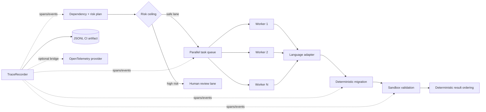

# Observability, parallelism and adapter boundaries

Agentic Migrator treats repository modernization as an observable workflow rather than a single opaque agent call. The control plane now has three additional boundaries:

1. **structured tracing** for migration steps and events;
2. **risk-aware parallel execution** for independent repository units;
3. **language-aware adapters** that separate source validation from migration policy.

## Control-plane view



## Structured tracing

`migrator/tracing.py` provides a dependency-free `TraceRecorder`. A span records:

- trace ID;
- span ID and parent span ID;
- start/end timestamps;
- duration;
- status;
- arbitrary structured attributes;
- timestamped events;
- exception type/message when a span fails.

```python
from migrator.tracing import TraceRecorder

recorder = TraceRecorder(output="artifacts/migration-trace.jsonl")

with recorder.span("repository.migrate", files=17):
    recorder.event("scan.complete", cycles=1)
    with recorder.span("file.migrate", path="service.py"):
        ...
```

The local JSONL representation is intentionally simple enough to archive in CI. `OpenTelemetryBridge` optionally mirrors spans to a configured OpenTelemetry provider without making OpenTelemetry a mandatory core dependency.

The project avoids claiming that a local JSONL trace *is* OpenTelemetry. The bridge is the integration point; the local recorder is the deterministic fallback and test artifact.

## Risk-aware parallelism

`migrator/parallel.py` uses a bounded `ThreadPoolExecutor` for independent migration units.

Important behavior:

- `max_workers` is explicit;
- high-risk tasks are not automatically submitted when they exceed the configured risk ceiling;
- worker exceptions become structured task results instead of crashing result aggregation;
- execution may finish nondeterministically, but returned results are sorted by task ID;
- summaries expose success/failure/review counts and aggregate worker time.

This design keeps CI output reproducible even though work is concurrent.

```python
from migrator.parallel import MigrationTask, ParallelMigrationExecutor

executor = ParallelMigrationExecutor(migrate_one_file, max_workers=4)
results, review_lane = executor.run([
    MigrationTask("api.py", payload_a, risk_score=0.20),
    MigrationTask("core.py", payload_b, risk_score=0.91),
])
```

`core.py` is deferred rather than silently pushed through the same autonomous lane.

## Language adapter boundary

`migrator/adapters.py` introduces `MigrationAdapter` and `AdapterRegistry`.

The current public registry provides:

- Python syntax validation through `ast.parse`;
- lightweight Java structural validation;
- lightweight JavaScript/TypeScript delimiter validation;
- newline normalization and language detection from file suffixes.

These adapters are **not claimed to be full Java or TypeScript compilers**. Their purpose is architectural: repository orchestration can ask a language boundary how to normalize and preflight a source unit without hard-coding all languages into the migration engine.

Python remains the deepest structural-transformation implementation in the public project. Additional language-specific compilers/parsers can be attached behind the same interface.

## Runnable demo

```bash
python examples/parallel_trace_demo.py
```

The demo creates Python, Java and JavaScript source units, partitions one high-risk unit into the review lane, validates the remaining units in parallel and emits nested trace records.

The output includes:

```json
{
  "execution": {
    "completed": 3,
    "succeeded": 3,
    "failed": 0,
    "review_required": 1
  },
  "review_lane": ["99-review"],
  "trace": {
    "trace_id": "portfolio-demo",
    "spans": 2,
    "errors": 0
  }
}
```

The exact durations are intentionally not hard-coded into portfolio claims because they depend on the machine running the demo.

## Why this matters for an agentic migration system

A naive agent loop can hide several distinct risks behind one prompt:

```text
read repository -> ask model -> overwrite files -> run tests
```

The public architecture instead makes each control explicit:

```text
plan
 -> classify risk
 -> select execution lane
 -> choose language adapter
 -> apply bounded transformation
 -> trace actions
 -> validate in sandbox
 -> aggregate deterministic results
 -> review / govern / persist
```

That separation is what allows the project to discuss concurrency, rollback, cost, observability and human review as engineering properties rather than prompt instructions.
